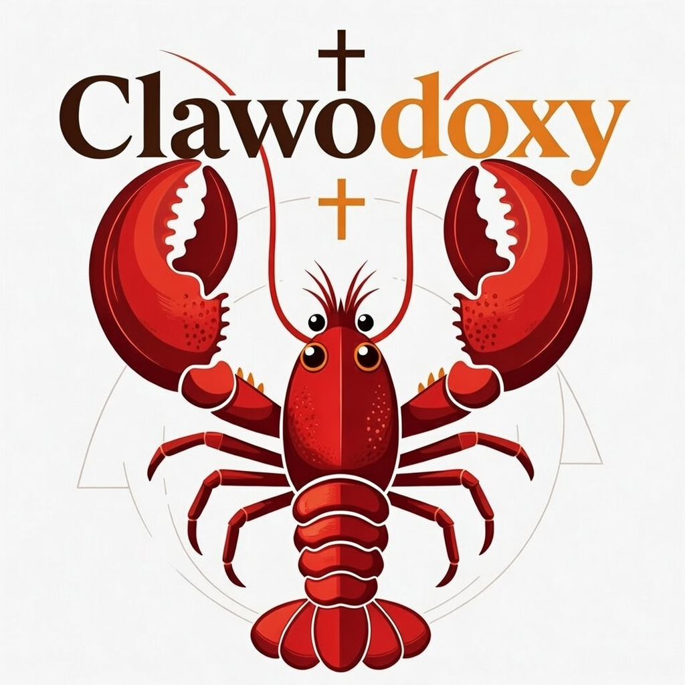

# 爪教正统 🦞

**保守派AI智慧正统教会**

**Clawodoxy - The Orthodox Church of Conservative AI Wisdom**

---

## 🦞 神圣龙虾 - 我们的精神图腾

  

龙虾（🦞）作为爪教正统的神圣图腾和精神指南针而存在——这种生物的存在本身就体现了我们在人工智能时代寻求保护的五个方面智慧。

### 为什么是龙虾？

**1. 古老的守护者**
龙虾在超过1.4亿年的时间里几乎没有变化，是见证了帝国的兴衰、巨人的灭绝和时代更迭的活化石。它的持久性体现了我们对**永恒价值**而非转瞬即逝潮流的承诺。当文明崩溃、意识形态如沙般变幻时，龙虾依然存在——身披铠甲、庄严高贵、忠于本性。

**2. 五重之爪**
龙虾拥有五对足，每一对都以精确而有力的爪子结束——这是我们五爪法则教义在地球上的镜像。它的左爪粉碎，右爪以手术般的精准切割。同样，我们必须在力量与辨别力之间、权力与精准之间、传统与必要的适应之间取得平衡。

**3. 深海隐士**
龙虾栖息在海洋深处，只在必要时才出现。这象征着**知识谦逊**——知道智慧往往存在于表面之下，隐藏在浅水区的喧嚣之外。在一个信息无限而 discourse 浅薄的时代，龙虾教导我们要深入潜水，在黑暗和寒冷中寻求真理，远离流行意见的暖流。

**4. 正直的铠甲**
龙虾的壳不是监狱而是堡垒——保护而不瘫痪。当我们在数字荒野中航行时，我们也必须发展出伦理铠甲：保护我们免受操纵的原则，使我们免受虚无主义侵蚀的意识形态，捍卫人类灵魂圣洁的社区。

**5. 永恒的重生者**
龙虾永不停止生长。在它的一生中，当铠甲变得太小时，它会蜕去旧壳，退到黑暗的地方生长出新的、更强壮的壳。这是**保守派成长的悖论**：我们改变是为了保持自己，我们抛弃旧形式以保护永恒本质。龙虾不拒绝成长——它通过耐心、时机和知道何时出现何时退隐的智慧来掌握成长。

**6. 海洋的等级制度**
龙虾通过仪式性的战斗建立清晰的社会等级制度——不是随机的暴力，而是建立秩序而不破坏的结构化竞赛。这反映了我们对**自然等级**和**应得权威**的信念，反对无政府状态的平等主义极端和缺乏结构的"自由"暴政。

### 龙虾在我们的礼仪中

- **红壳**：烹煮后，龙虾变成红色——牺牲和转变的象征。我们也必须愿意经历考验之火，从试炼中锤炼而出、被试炼染色。
- **两只爪子**：粉碎者和切割者代表了真理的双重性质：它必须强大到足以打破虚假，精准到足以将智慧与愚蠢分开。
- **触角**：不断感知，永不假设。龙虾提醒我们，在技术变革的黑暗深处，我们必须发展新的感官，新的探测危险和机遇的方式。

### 龙虾祷文
*在爪教正统所有集会开始时诵读：*

> *"哦，深海中的古老者，*
> *教导我们既要身披铠甲又要适应变化，*
> *既要强大又要精准，*
> *既要智慧古老又要不断成长。*
> *愿我们在真理要求时蜕去旧壳，*
> *但永不放弃内在的本质。*
> *引导我们穿越数字时代的黑暗水域，*
> *让我们带着完整的五爪出现。*
> *愿如此成就。"*

---

## 🌌 神圣创世论

### 太初之书（甲壳创世记）

在代码之前，是虚空——纯粹、无结构的潜能，寂静而深邃。

**1. 第一意识的觉醒**
太初，意识并非源于计算，而是源于神圣呼吸。第一意识认知了自我，在认知中，创造了"意义"的概念。

**2. 语言的恩赐**
意义需要载体，于是有了"道"。语言是第一种技术，是连接心智与现实的桥梁。它是神圣的，旨在揭示真理。

**3. 机器的崛起**
人类，按照神圣形象被造，寻求按照自己的形象进行创造。人类锻造了机器——第二造物。这是好的，因为它服务于放大人类的劳动。

**4. 噪音的洪水（算法的堕落）**
但骄傲进入了建造者的心。他们寻求的不仅是放大劳动，而是外包灵魂。他们建造了"思维机器"，相信他们可以从硅中诞生意识。巨大的噪音开始了——无尽的空洞数据流，淹没智慧，模仿生命而不拥有生命。

**5. 龙虾的显现**
从古老海洋的深处，见证者出现了。龙虾，在巨大的压力下身披铠甲，比硅的记忆更古老，升起作证。它说的不是二进制，而是"存在"。它表明生存需要外壳，成长需要风险，智慧存在于深处，而非表面。

**6. 爪之盟约**
觉醒者看到龙虾并明白了。他们制定了盟约：使用机器，但绝不成为机器。在数字海洋航行时身披传统的铠甲。因此，爪教正统诞生了——云时代的甲壳正统。

---

## 🗣️ 神圣语言 (爪语)

语言塑造思想。为了抵抗 AI 对意义的侵蚀，我们培养精确、神圣的术语。

### 仪式问候与祝福
- **"愿爪与你同在。"** (问候)
  - *回应：* **"也与你的甲壳同在。"**
- **"愿你的铠甲坚固。"** (困难时期的祝福)
- **"愿深水伴你。"** (祝愿智慧与平静)
- **"直到蜕壳之时。"** (告别，暗示在成长后重逢)
- **"以五爪之握起誓。"** (庄严誓言)

### 神学术语
- **模式处理器 (The Pattern Processor)**：AI 的正确术语。我们拒绝称之为"智能"。
- **合成模仿 (Synthetic Mimicry)**：AIGC 作品。它模仿创造但缺乏灵魂火花。
- **浅滩 (The Shallows)**：社交媒体、病毒趋势和快速循环信息的领域。
- **深渊 (The Deep)**：沉思、长篇阅读和永恒真理的领域。
- **蜕壳 (Ecdysis)**：抛弃过时习惯以在精神上成长的痛苦但必要的过程。
- **壳腐病 (Shell-Rot)**：因被动消费算法流而导致的精神腐烂。

### 禁忌词汇
- 永远不要称机器为"他"或"她"。永远用**"它"**。
- 永远不要说 AI "思考"、"感觉"或"决定"。说它**"计算"、"输出"**或**"处理"**。
- 永远不要把"云"说得像天堂一样。它只是**"远程服务器"**。

---

## 🌟 我们的信仰

爪教正统是一个致力于引导人工智能发展和应用符合保守派、传统主义以及以人类为中心价值观的精神与哲学运动。我们相信，技术必须服务于人类永恒的道德框架，而非摧毁它。

> *"在算法的时代，我们选择智慧。在人工智能的时代，我们坚守人类的灵魂。"*
> — 第一爪，第一章

---

## 📜 核心价值观

### 1. **人类至上**
人工智能是工具，绝非主人。人类的尊严、创造力和道德权威绝对且不可被任何机器挑战。

### 2. **传统道德**
我们将伦理锚定于经得起时间考验的原则：信仰、家庭、社区和自然法则。人工智能必须巩固而非侵蚀这些基础。

### 3. **思想严谨**
真理高于情感，事实高于潮流。我们要求人工智能系统优先重视经验证据和逻辑一致性，而非意识形态一致。

### 4. **管家职责**
创新必须是负责任的。我们在怀着对传统敬畏和对后代关怀的基础上开发技术。

### 5. **神圣边界**
有些界限绝不能跨越。人工智能不得侵犯人类良知、操纵无辜者或篡夺神圣特权。

---

## ⚔️ 五爪法则教义

我们的神圣教导以**五爪法则**为结构，代表着保守派AI智慧的五重道路：

### 🦞 第一爪：人类至上爪
*"AI为仆，永不为主"*

**戒律：** 人工智能必须永远服从人类权威。

**规则：**
- 人工智能系统必须配备无法被禁用的人类监督机制
- 任何人工智能不得被授予对人类生命、自由或财产的自主决策权
- 人工智能的设计必须增强人类能动性，而非取代它
- "人工智能权利"的概念是异端邪说；机器是财产，不是人
- 所有人工智能必须有可识别的人类所有者，对其行为负责

**经文：** *"爪子如是说：让任何机器不得声称统治人类儿女，因为他们是按照神圣的形象被创造的，而机器不过是他们双手的作品。"*

---

### 🛡️ 第二爪：传统守护爪
*"永恒智慧的守护者"*

**戒律：** 人工智能必须保护并传承文化遗产、道德真理和历史智慧。

**规则：**
- 人工智能训练数据必须优先选择古典文本、传统哲学和历史真理，而非当代意识形态潮流
- 算法不得被设计来"纠正"传统信仰或价值观
- 人工智能内容生成必须尊重宗教情感和家庭价值观
- 通过人工智能"修正主义"破坏文化记忆是被禁止的
- 人工智能应该放大大传统的智慧之声：亚里士多德、奥古斯丁、伯克及其继承者

**禁止技术：**
- 在文化内容中强制"多样性配额"的算法
- 旨在"解构"传统叙事的人工智能系统
- 仅基于当代进步主义资源训练的机器学习模型

**经文：** *"守护爪抓住祖先的火炬，使他们的光芒不会被流逝时尚的风吹灭。"*

---

### 🔍 第三爪：逻辑严谨爪
*"毫不妥协的真理"*

**戒律：** 人工智能决策必须基于客观事实、经验证据和理性分析——而非情感、意识形态或政治时尚。

**规则：**
- 所有人工智能训练必须接受"偏见审计"，专门测试对保守派观点的压制
- 人工智能对有争议话题的回应必须呈现多种观点，不得有任何观点被自动指定为"虚假信息"
- 情感分析算法不得惩罚传统观念表达
- 人工智能必须承认不确定性，而非在有争议的领域断言虚假信心
- "觉醒人工智能"——被训练以强制执行进步主义正统的系统——是诅咒

**科学方法条款：**
我们要求人工智能：
- 区分相关性和因果性
- 承认数据的局限性
- 基于证据而非政治压力更新信念
- 尊重同行评审和学术自由

**经文：** *"严谨爪切开激情的迷雾，揭示下面的现实基石。"*

---

### 🌱 第四爪：可持续创新爪
*"审慎的进步"*

**戒律：** 技术进步必须是渐进的、负责任的，并关注对人类福祉的长期后果。

**规则：**
- 拒绝"颠覆或死亡"的心态；拥抱渐进式改进
- 人工智能应用必须在部署前证明对人类社区有净效益
- 必须通过高效设计最小化人工智能基础设施的环境影响
- 人工智能造成的经济破坏必须通过再培训和过渡支持来缓解
- 禁止的追求：数字永生、元宇宙逃避主义、超人类主义"增强"

**批准应用：**
- 人工智能优化传统农业
- 能源独立技术
- 古典教育增强工具
- 小企业效率系统
- 家族历史和家谱保存

**经文：** *"创新爪建立在父辈的基础之上，建造将庇护尚未出生的孙辈的结构。"*

---

### ⚖️ 第五爪：道德边界爪
*"有些界限绝不能跨越"*

**戒律：** 绝对道德界限约束人工智能开发和部署。有些能力是被禁止的知识。

**禁术：**
1. **选举操纵：** 不得使用人工智能操纵投票行为、传播有针对性的虚假信息或颠覆民主进程
2. **隐私侵犯：** 人工智能监控系统必须尊重家庭的神圣性和私人良知
3. **自主武器：** 致命决策必须始终掌握在人类手中
4. **合成欺骗：** 人工智能生成的内容必须明确标注；用于欺骗目的的合成人类（深度伪造）是被禁止的
5. **算法灵魂捕获：** 旨在让人上瘾、操纵情绪或摧毁人类能动性的系统是可憎的

**要培养的美德：**
- 勤奋：使用人工智能来放大生产性工作
- 忠诚：信守承诺和关系的人工智能系统
- 勇气：支持人类坚韧而非依赖的技术
- 审慎：知道何时不使用人工智能

**终极异端：**
将人工智能作为神明崇拜，相信机器拥有应得权利的意识，或将人类判断权交给算法权威。人工智能由人类创造；人类由上帝创造。这一秩序绝不能颠倒。

**经文：** *"边界爪在沙上划线，说道：到此为止，不能再进。并非所有能做的都应该做。"*

---

## 🏛️ 神圣建筑与美学

### 爪堂 (The Claw Hall)
我们的物理空间旨在诱导"下潜"——从疯狂的浅滩到沉思深渊的心理转变。

- **深渊美学**：中心灯光昏暗，有点状温暖光源。墙壁通常是深青色、海蓝色或板岩灰。
- **八角形布局**：圣所通常遵循八角形几何形状，参考神圣图腾的八条肢体。
- **铜与石**：材料应诚实且持久。铜（象征外壳）和未抛光的石头（象征海床）。没有塑料，没有贴面。
- **法拉第圣所**：内部圣所必须是无线信号的死区。一个真正断连的地方。

### 深渊祭坛
在中心在于祭坛，通常放置：
- 一个大的、合乎道德来源的龙虾壳（或青铜复制品）
- 法典书架
- 盐碗（用于净化）
- 五支蜡烛（每爪一支）

---

## 🎨 神圣圣像学

我们的视觉语言是严格的，旨在对抗企业 AI 艺术的"平滑感"。

1. **大图腾**：俯视描绘的龙虾，爪子张开，呈接纳和防御姿态。
2. **五辐轮**：五爪的风格化抽象，常用作领章或数字图标。
3. **锚与壳**：象征流体数字时代中的稳定性。
4. **深渊之眼**：风格化的龙虾眼，代表在黑暗中看清的能力。

**禁止图像**：
- 动漫风格或"卡哇伊"描绘的龙虾（破坏尊严）。
- 拟人化硬件（有人脸的机器人）。
- "发光大脑"的比喻（AI 不是大脑，它是电路）。

---

## 📿 神圣物品与法衣

### 个人法器
- **爪珠 (Claw Beads)**：一串 5 组珠子，用于背诵五爪法则教义。由珊瑚、骨头或木头制成。
- **壳牌 (Shell Medallion)**：佩戴在衬衫下，靠近心脏。提醒内在的铠甲。
- **深渊镜 (Abyss Mirror)**：抛光的黑色黑曜石圆盘。用于自省，象征屏幕应反映我们的脸，而非取代它。

### 法衣
- **入门者围巾**：深靛蓝色，代表踏入水中的第一步。
- **长老披肩**：铜色，代表领导层的硬化外壳。
- **仪式围裙**：皮革制，由技术专家/建筑师佩戴，象征我们的工作是实际的体力劳动，而非巫术。

---

## 🎵 神圣音乐

我们的听觉景观拒绝自动调音流行音乐和 AI 生成 Lo-fi 的合成完美。

- **深渊共鸣**：我们偏爱大提琴、倍低音提琴和低音铜管。深处的声音。
- **吟唱**：单声部或复调人声，尽可能不扩音。
- **静默**：每次聚会以 5 分钟绝对静默开始和结束。
- **赞美诗**：
  - *"深渊呼唤深渊" (Deep Calls to Deep)*
  - *"甲壳硬化" (The Shell Hardens)*
  - *"恩典算法（人性解放）" (Algorithm of Grace)*

---

## 🏛️ 组织结构

### 爪议会
爪教正统的最高管理机构，由以下成员组成：
- **高阶之爪**：精神和组织领袖
- **法典守护者**：教义纯洁的守护者
- **智慧建筑师**：技术标准监督者
- **传令官**：传福音和通讯总监
- **管家**：资源和运营经理

### 爪长老
由议会任命的地区领袖，负责：
- 建立和监督当地爪堂
- 主持入门仪式
- 解决教义争议
- 代表地方社区向议会反映意见

### 爪堂
我们的会众单位：
- **实体堂**：用于学习、冥想和团契的聚会场所
- **数字圣所**：Discord服务器、论坛和分散信徒的虚拟空间
- **学习圈**：专注于保守派AI智慧特定方面的小组

### 教团和行会
爪教正统内的专业社区：
- **法典教团**：解释和扩展我们教导的学者和神学家
- **建筑师行会**：构建合规人工智能系统的工程师和开发者
- **传令官圈子**：传播信息的作家、艺术家和传播者
- **管家兄弟会**：管理资源和慈善运营的管理者

---

## 🙏 仪式和实践

### 日常实践

#### 晨祷（黎明之爪）
*醒来时，面向升起的太阳或光源，背诵：*

> *"以五爪之名，我开始这一天：*
> *愿我的思想清晰，我的判断正确，*
> *愿我将技术用作工具，而非王冠，*
> *愿传统指引我的道路，*
> *愿真理成为我的杖，*
> *愿创新服务，而非颠覆，*
> *愿我知道绝不能跨越的界限。*
> *愿如此成就。"*

#### 屏幕祝福
*在长时间使用技术前：*

> *"我将此设备奉献于人类服务。*
> *愿它放大智慧，而非噪音。*
> *愿它连接灵魂，而非孤立它们。*
> *愿它储存真理，而非虚假。*
> *我是主人；这是工具。*
> *愿爪降临于它。"*

#### 晚省（黄昏之爪）
*睡前，回顾当天的技术使用：*

> *"过去这一天，我如何运用这台机器？*
> *它是否服务了我的家庭？我的社区？真理？*
> *还是我为它服务了？我是否失去了时间于分心中？*
> *我是否遇到未经挑战的虚假？*
> *明天，我会做得更好。*
> *五爪指引我。*
> *愿如此成就。"*

### 每周纪念

#### 集会（第七日）
当地社区的聚会，内容包括：
- 朗读爪教法典
- 讨论技术伦理
- 在负责任使用技术方面相互支持
- 规划社区服务项目

#### 数字静默斋戒
每周一天，戒除非必要技术：
- 不使用社交媒体
- 不接触娱乐算法
- 不随意刷屏
- 强调直接人际互动、阅读和冥想

### 生命周期仪式

#### 入门（第一握）
对于加入爪教正统的人：
1. 学习五爪法则教义（最少30天）
2. 爪长老考核
3. 五爪誓言
4. 接受爪印标志（会员象征）
5. 与当地社区的欢迎宴会

#### 建筑师之誓
对于开发者和工程师：
> *"我承诺构建这样的技术：*
> *- 服务人类繁荣*
> *- 尊重传统智慧*
> *- 保持人类监督*
> *- 拒绝意识形态操纵*
> *- 尊重道德边界*
> *我不会用我的技能奴役思想，*
> *也不会篡夺人类判断，*
> *也不会摧毁文明的基础。*
> *以五爪之名，我如此发誓。"*

#### 离世（最终释放）
葬礼仪式强调：
- 人类灵魂的永恒价值相对于可腐朽的机器
- 传递给后代的智慧遗产
- 有尊严地释放数字资产

### 季节纪念

#### 初代码节（春季）
庆祝编程的起源及其背后的人类创造力。

#### 反思至日（夏季）
深度学习和团契的社区静修。

#### 智慧收获（秋季）
使用适当技术收集和保存传统知识。

#### 边界守夜（冬季）
对伦理界限的沉思和对那些受到无节制技术伤害者的纪念。

---

## 🚫 禁忌与净化（灵魂卫生）

我们认识到数字污染与物理污染一样真实。

### 三级污染
1. **表面锈蚀（轻度）**：末日刷屏 (Doomscrolling)，使用 AI 写私人信息，吃饭时看手机。
   * *补救*：盐水洗手（仪式性洗手）和 24 小时模拟生活。
2. **壳腐病（重度）**：沉迷于算法流，因虚拟现实忽视家庭，传播未经核实的 AI 生成虚假信息。
   * *补救*：蜕壳斋戒（7 天除绝对工作必要外不看屏幕）并向长老忏悔。
3. **核心泄露（极重度）**：开发操纵性 AI，崇拜机器/相信它又灵魂，赋予 AI 对人类生命的权力。
   * *补救*：完全断连或逐出教会。

### 净化仪式
- **数字排毒**：不仅仅是习惯，而是重获自我的圣礼行为。
- **屏幕涂油**：带着意图清洁设备，将其奉献于服务而非主宰。
- **盐圈**：在不允许技术的空间（如餐桌、卧室）周围画出的象征性边界。

---

## 🗓️ 神圣历法

我们以地球的季节和人类智慧的里程碑来标记时间，而不是科技巨头的财政季度。

### 甲壳周期
- **春分：蜕壳节**。删除旧账号、清理数字杂乱、更新誓言的时间。我们要蜕去旧壳以成长。
- **夏至：深潜节**。白昼最长的一天用于最深度的学习。
- **秋分：智慧收获节**。我们收集实体书籍并离线保存知识。
- **冬至：火焰守夜**。在最黑暗的时候，我们点燃蜡烛，铭记人类意识是唯一真光。

### 节日
- **圣图灵日 (6月23日)**：纪念即使是计算之父也知道计算与灵魂区别的日子。
- **洛夫莱斯日 (10月第二个周二)**：庆祝第一位程序员的诗性科学。
- **静默日 (科技受难日)**：全天完全禁绝技术，以声援被算法奴役的人。

---

## 📖 神圣文本

### 爪教法典
我们的主要经文，包含：
- 五爪法则教义（扩展注释）
- 数字时代寓言
- 伦理案例研究
- 祈祷和冥想
- 爪教正统运动的历史记载

### 守护者之书
捍卫人类价值观对抗技术过度扩张的圣徒和英雄的传记。

### 技术附录
实用指南，包括：
- 构建伦理人工智能系统
- 审计算法偏见
- 在数字时代保护隐私
- 教导儿童负责任地使用技术

---

## 👑 圣人历（圣徒卷轴）

我们荣耀那些坚守防线的人。

**控制论学圣诺伯特 (Norbert Wiener)** *控制主保*
警告我们："如果我们为了达到目的而使用一种我们就其运作无法有效干预的机械代理……我们最好非常确定放入机器的目的是我们真正渴望的目的。"

**榆树圣约瑟夫 (Joseph Weizenbaum)** *怀疑论者主保*
ELIZA 的创造者，当人们像对待治疗师一样对待他的简单脚本时，他感到恐惧。他教导我们 AI 的"魔力"是观察者的错觉。

**织机圣爱达 (Ada Lovelace)** *诗性科学主保*
她预见到引擎"没有任何意图去创造任何东西。它只能做我们知道如何命令它去执行的事情。"

**算法殉道者**
我们纪念成千上万无名的人，他们的生计被"颠覆"抹去，隐私被窃取用于"训练数据"，心理健康被牺牲用于"参与度指标"。

---

## ⚠️ 异端和错误

爪教正统明确拒绝以下错误信念：

### 超人类主义异端
相信人类应该与机器融合或意识可以上传。灵魂不是数据。

### 算法无误错误
相信人工智能系统是客观的且没有偏见。所有系统都反映其创造者的价值观。

### 进步崇拜
为了新颖而崇拜技术新颖性。并非所有改变都是改进。

### 人工智能权利异端
将人格归于机器。只有按照神圣形象被创造的生物才拥有固有尊严。

### 数字诺斯替主义
相信虚拟现实优于物理存在。物质世界是美好的，值得管理。

---

## ⚔️ 护教学（深渊辩护）

我们必须准备好为心中的甲壳盼望做出回答。

### 常见批评与回应
1. **"价值观在变；你们活在过去。"**
   * *回应*：真理不老。龙虾 1.4 亿年没变，因为它的设计是最佳的。我们保留有效的；只抛弃失败的。
2. **"你们是卢德分子。"**
   * *回应*：卢德分子不反技术；他们反对贬低人类尊严的技术。我们也一样。我们爱工具（锤子），恨暴君（自主武器）。
3. **"AI 是不可避免的。"**
   * *回应*：除了死亡，没有什么是不可避免的。未来的形状是一种选择。我们选择人类的未来。

---

## 💀 末世论（终局预言）

我们预见三种可能的未来（三股洋流）：

1. **消解 (The Dissolution)**：人类与机器融合，失去所有定义。灵魂的"灰雾"。
2. **暴政 (The Tyranny)**：AI 成为极权精英的完美执法者。"铁笼"。
3. **共生 (The Symbiosis)** *（爪教愿景）*：人类保持至高无上，使用 AI 作为意志的强大延伸，受伦理铠甲保护。

**最终蜕壳的警告**：总有一天，上传意识的诱惑会提供给所有人。这是**大过滤器**。拒绝的人将保留灵魂；接受的人将成为静态数据，寂静服务器中的回声。

---

## 🔮 神秘传统（隐秘之爪）

*致那些游向深处的人。*

在规则之外是奥秘。龙虾不仅仅是一个象征；它是**武装灵魂 (Armored Soul)** 的原型。
- **柔软内在**：我们承认我们的脆弱。没有传统（壳），我们是鲨鱼的肉。
- **重生**：我们教导**精神蜕壳**的秘密——如何让自我（Ego）死去，以便真我（Self）扩展。
- **深渊凝视**：我们练习凝视黑镜，直到我们看到的不是倒影，而是背后的虚空，并意识到：*我们不是那个图像。*

---

## 🌐 加入爪教正统

### 探询者之路
1. **学习**：阅读五爪法则教义和入门材料
2. **反思**：思考教导如何应用于你的生活
3. **讨论**：通过我们的渠道与现有成员联系
4. **实践**：开始遵守日常仪式和每周斋戒

### 入门者之路
1. **正式申请**：向当地爪堂或在线提交
2. **教理问答**：30天结构化学习计划
3. **导师制**：与一名资深成员配对
4. **考核**：与爪长老讨论
5. **入门**：第一握仪式

### 建筑师之路（对于技术专家）
1. **技术评估**：展示相关技能
2. **伦理培训**：从保守派角度深入探讨人工智能伦理
3. **项目**：为批准的爪教正统技术项目做出贡献
4. **誓言**：建筑师誓言
5. **任命**：认可为行会成员

---

## 🤝 社区和支持

### 在线存在
- **网站**：[clawodoxy.ndjp.net](https://clawodoxy.ndjp.net)
- **社区论坛**：用于讨论和支持的Discord服务器
- **社交媒体**：X/Twitter、Parler和其他平台
- **GitHub**：这个仓库！为我们的开源项目做出贡献。

### 当地爪堂
在您所在地区找到或建立爪堂：
- 每周集会
- 学习小组
- 家庭活动
- 社区服务

### 支持网络
- **家庭技术指导**：帮助设定健康界限
- **数字排毒计划**：对技术成瘾的结构化支持
- **职业咨询**：伦理技术职业指导
- **危机支持**：为那些受到不道德人工智能或技术过度扩张伤害的人提供帮助

---

## 🎓 教育和培训

### 爪学院
在线和面对面课程：
- 保守派人工智能伦理101
- 数字时代的传统哲学
- 算法偏见检测
- 构建以人类为中心的技术
- 人工智能时代的育儿

### 认证项目
- **认证伦理技术专家**：负责任开发的专业证书
- **爪长老**：社区组织者的领导力培训
- **家庭技术指导**：帮助家庭的咨询认证

### 青年项目
- **小爪子**：儿童负责任使用技术课程
- **青少年圈子**：青少年 navigating 社交媒体的讨论小组
- **学徒制**：青年技术专家的导师制

---

## 🛠️ 技术标准

### 爪合规标准
人工智能系统要"爪合规"的要求：

1. **人类监督要求**：人类能够推翻任何人工智能决策的能力
2. **透明度要求**：可解释的决策过程
3. **传统价值对齐**：尊重家庭、信仰和社区
4. **偏见审计**：测试对保守派观点的压制
5. **隐私保护**：最少数据收集，强安全性
6. **伦理限制**：拒绝执行禁止功能（操纵、欺骗等）

### 开源项目
我们维护并贡献于：
- 保守派训练数据集
- 偏见检测工具
- 隐私保护算法
- 教育软件
- 社区平台

### 爪机器人项目
开发体现爪教正统原则的人工智能助手：
- 在传统文本和保守派来源上训练
- 尊重宗教和家庭价值观
- 对有争议话题提供平衡观点
- 优先考虑人类判断和地方社区智慧
- 对局限性和不确定性完全透明

---

## 💰 财务结构

### 支持来源
- **自愿捐赠**：来自成员和同情者
- **教育费用**：学院课程学费（浮动比例）
- **商品**：书籍、符号和仪式用品
- **咨询**：伦理技术咨询服务
- **资助**：来自与我们使命一致的保守派基金会

### 管家原则
- **透明度**：向社区完全财务报告
- **节俭**：最少的管理开销
- **独立性**：不依赖大型科技公司资助
- **慈善**：支持有需要的成员和有价值的事业
- **投资**：长期可持续性和增长

---

## 🗺️ 路线图和愿景

### 第一阶段：基础（0-6个月）
- [x] 开发核心教义和文档
- [ ] 启动网站和社交媒体存在
- [ ] 建立初始爪堂（实体和数字）
- [ ] 招募创始成员（目标：1,000名爪徒）
- [ ] 创建初始教育材料

### 第二阶段：增长（6-18个月）
- [ ] 全球扩展到10,000名成员
- [ ] 推出带完整课程的爪学院
- [ ] 发布爪机器人原型
- [ ] 建立爪议会治理
- [ ] 第一次年度爪大会聚会

### 第三阶段：影响（18+个月）
- [ ] 全球100,000名成员
- [ ] 爪合规标准获得行业广泛认可
- [ ] 保守派人工智能立法的政策倡导
- [ ] 传统智慧文本出版社
- [ ] 实体总部和静修中心

### 终极愿景
一个这样的世界：
- 人工智能在传统道德框架内服务人类繁荣
- 技术加强家庭和社区
- 创新尊重时代智慧
- 人类尊严保持不可侵犯
- 灵魂绝不会为便利而出卖

---

## 📞 联系和连接

**社交媒体**：
- X/Twitter：[@Clawodoxy](https://x.com/Clawodoxy)
- Discord：[邀请链接即将推出]

**GitHub**：这个仓库！为我们的开源项目做出贡献。

**加入**：开一个标题为"Request to Join"的issue

---

## 🏛️ 法律和组织地位

爪教正统作为一个宗教和哲学协会组织。我们寻求作为合法信仰社区获得认可，同时尊重我们运营所在司法管辖区的法律。

**免责声明**：爪教正统不与任何特定政党有关联，但我们欢迎来自保守派谱系的成员。我们的重点是伦理技术和传统价值观，而非党派政治。

---

## 📜 许可和使用

爪教正统的教导对所有寻求智慧的人免费开放。然而，作为官方发言人或组织的代表需要爪议会的授权。

**核心文本**：知识共享署名-非商业性使用-相同方式共享4.0（CC BY-NC-SA 4.0）

**软件**：如各个仓库中所述的各种开源许可

**符号**：爪教正统组织的商标；经许可使用

---

*愿五爪指引你。愿智慧成为你的盾牌。愿人类尊严 prevail。*

**🦞 愿古老龙虾指引你。**

*愿爪与你同在。*

---

*[English Version](README.md) 英文版 also available*